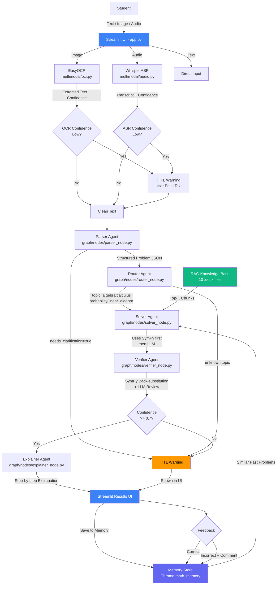

# 📐 JEE Math Mentor

An end-to-end AI application that solves JEE-style math problems, explains solutions step-by-step, and improves over time using memory.

Built with: LangGraph · RAG · Multi-Agent System · HITL · Memory

---

## 🚀 Live Demo

👉 https://math-aimentor.streamlit.app/

---

## 🏗️ Architecture



---

## 📁 Project Structure

```
ai_planet_task/
│
├── app.py                        # Streamlit UI — main entry point
│
├── graph/
│   ├── state.py                  # Shared state across all agents
│   ├── graph_builder.py          # LangGraph pipeline
│   └── nodes/
│       ├── parser_node.py        # Cleans input → structured JSON
│       ├── router_node.py        # Classifies math topic
│       ├── solver_node.py        # RAG + SymPy + LLM solver
│       ├── verifier_node.py      # Verifies solution correctness
│       └── explainer_node.py     # Student-friendly explanation
│
├── multimodal/
│   ├── ocr.py                    # EasyOCR image → text
│   └── audio.py                  # Whisper audio → text
│
├── rag/
│   ├── ingest.py                 # Load + chunk .docx files
│   ├── retriever.py              # Search vector store
│   └── vector_store.py           # Chroma + HuggingFace embeddings
│
├── memory/
│   └── memory_store.py           # Save + retrieve solved problems
│
├── utils/
│   ├── config.py                 # Environment variables
│   └── llm.py                    # FreeFlow LLM wrapper
│
├── knowledge_base/               # 10 .docx math reference docs
├── vector_store/                 # Auto-generated Chroma DB
│
├── requirements.txt
├── packages.txt                  # System deps for Streamlit Cloud
├── .env.example
└── README.md
```

---

## ⚙️ Setup

### 1. Clone the repo

```bash
git clone https://github.com/yourusername/ai_planet_task.git
cd ai_planet_task
```

### 2. Create virtual environment

```bash
python -m venv myvenv

# Windows
myvenv\Scripts\activate

# Mac/Linux
source myvenv/bin/activate
```

### 3. Install dependencies

```bash
pip install -r requirements.txt
```

### 4. Set up environment variables

```bash
cp .env.example .env
```

Edit `.env` and add your API keys:

```
GROQ_API_KEY=your_key_here
GEMINI_API_KEY=your_key_here
GITHUB_TOKEN=your_token_here
```

Get free keys:
- Groq → https://console.groq.com
- Gemini → https://aistudio.google.com
- GitHub → https://github.com/settings/tokens

### 5. Build the vector store

Place your `.docx` knowledge base files in `knowledge_base/` folder, then:

```bash
python -c "from rag.vector_store import build_vector_store; build_vector_store()"
```

### 6. Run the app

```bash
streamlit run app.py
```

---

## 🤖 Agents

| Agent | File | What it does |
|---|---|---|
| Parser | `parser_node.py` | Cleans OCR/ASR errors, extracts structured problem |
| Router | `router_node.py` | Classifies topic: algebra/calculus/probability/linear_algebra |
| Solver | `solver_node.py` | Solves using RAG + SymPy + memory context |
| Verifier | `verifier_node.py` | Checks correctness via SymPy back-substitution + LLM |
| Explainer | `explainer_node.py` | Generates student-friendly step-by-step explanation |

---

## 🧠 Features

- **Multimodal input** — text, image (EasyOCR), audio (Whisper)
- **RAG pipeline** — 10 curated math docs, Chroma vector store
- **SymPy integration** — exact symbolic math for algebra/calculus
- **HITL** — triggers on low OCR/ASR confidence, parser ambiguity, verifier uncertainty
- **Memory** — stores every solved problem, retrieves similar past solutions at runtime
- **Feedback loop** — correct/incorrect feedback saved to memory

---

## 📚 Math Scope

- Algebra
- Probability
- Basic Calculus (limits, derivatives, integration)
- Linear Algebra basics

JEE-style difficulty.

---


## 📝 Environment Variables

| Variable | Required | Description |
|---|---|---|
| `GROQ_API_KEY` | ✅ | Primary LLM provider |
| `GEMINI_API_KEY` | ⚠️ Optional | Fallback LLM provider |
| `GITHUB_TOKEN` | ⚠️ Optional | Fallback LLM provider |
| `VECTOR_STORE_PATH` | ⚠️ Optional | Chroma DB path (default: `vector_store`) |